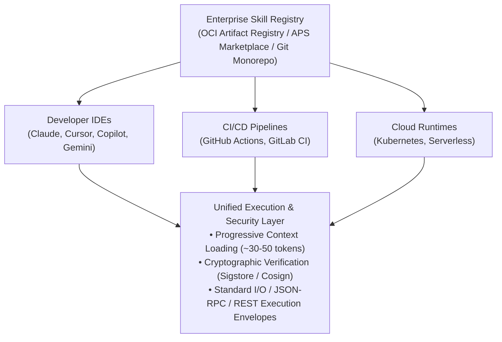
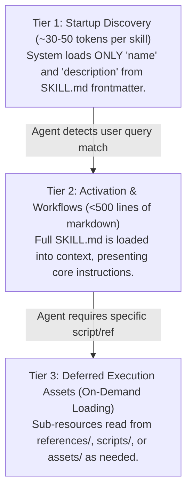
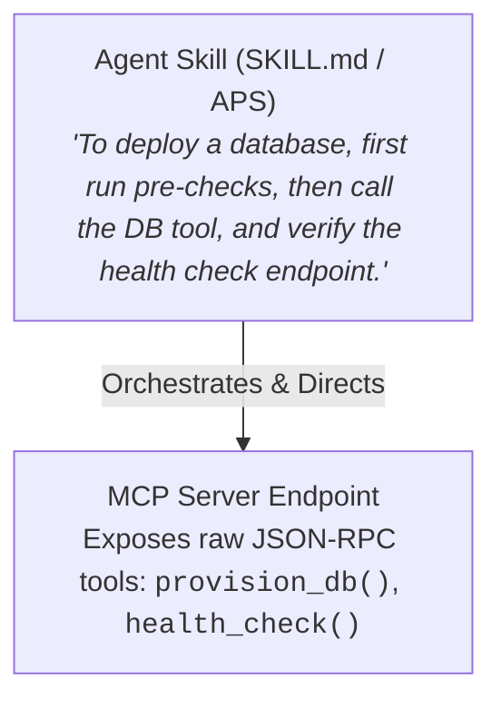
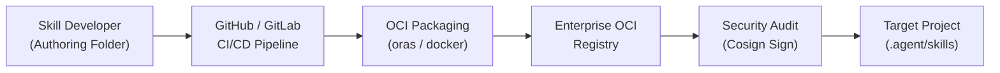
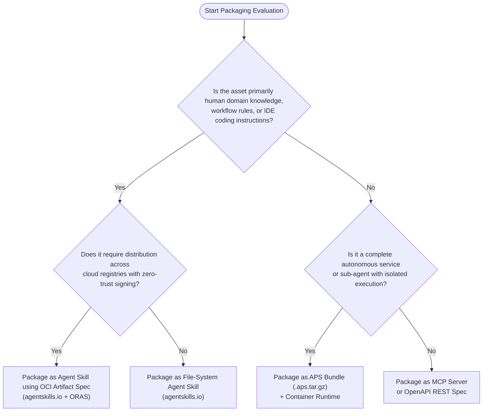

# Architectural Guide: Enterprise Packaging and Distribution of AI Agent Skills

**Document Version:** 1.1  
**Target Audience:** Chief Architects, Enterprise Software Architects, AI Platform Engineers, DevSecOps Leads  
**Topic:** Architectural Evaluation of Protocols, Packaging Specifications, and Distribution Paradigms for Enterprise AI Agent Capabilities  

---

## Provenance and Verification Note

This document is a **background whitepaper at enterprise altitude**, not a
source-verified evaluation like the ADRs in this folder. It carries no per-claim
citations. On 2026-09-05 the four load-bearing standards/tools named below were
independently confirmed to exist:

- Agent Skills SKILL.md open standard — https://agentskills.io (published as an
  open standard 2025-12-18).
- Agent Skills as OCI Artifacts (`application/vnd.agent-skills.skill.v1`) —
  https://github.com/ThomasVitale/agents-skills-oci-artifacts-spec and
  `agentskills/agentskills` discussion #292.
- Agent Packaging Standard (APS) — https://agentpackaging.org.
- `vercel-labs/skills` (`npx skills`) — https://github.com/vercel-labs/skills.

**Not verified against upstream:** the specific manifest fields, CLI flags, version
numbers (e.g. `apsVersion: "0.1"`), and example schemas below are illustrative and
may not match current upstream specs — confirm before relying on any exact syntax.
The APS/OCI/Cosign code blocks, media types, and diagrams throughout read
authoritatively but carry this same caveat; treat them as illustrative, not
copy-pastable.

**Two specific corrections where this whitepaper conflicts with source-verified
findings in [ADR 002](002-skill-manager-tool-selection.md):**

- **GitHub Copilot compatibility is overstated.** This document's adoption tables
  and prose (§2.2, §3, §6) imply Copilot has "universal / instant" support for the
  `agentskills.io` SKILL.md *folder* format. ADR 002 source-verified the opposite:
  real GitHub Copilot / Copilot CLI are **file-based** (`.github/instructions/*.instructions.md`
  with `applyTo`), and **no** surveyed tool — `vercel-labs/skills` included — serves
  Copilot by a skills directory. Treat Copilot as file-based per ADR 002; the
  "universal" claim here is contested.
- **`npx skills` command vocabulary differs from the verified set.** §5.2 shows
  `npx skills find/add/sync`; the source-verified command set at HEAD `435076e` is
  `add` / `--skill` / `remove` / `install` / `use` / `list` / `update` (see the
  scorecard, [skill-manager-vercel-labs-scorecard-2026-09-05.md](skill-manager-vercel-labs-scorecard-2026-09-05.md)).
  Use the scorecard's set, not §5.2's, for exact commands.

**Relevance to this project (a solo-developer, per-project skill-selection use
case):** most of this document — APS registries, OCI+Cosign supply-chain signing,
SBOMs, multi-tenant marketplaces, Kubernetes runners — is enterprise-scale and out
of scope. Its concrete contribution was surfacing `vercel-labs/skills`, now
evaluated as [Option 14 in ADR 002](002-skill-manager-tool-selection.md). The
distribution standards are scoped there under Consequences/Open questions as a
future-only path, not adopted.

---

## Executive Summary

As enterprise adoption of generative AI evolves from experimental LLM wrappers to autonomous agentic systems, software architecture teams face a fundamental engineering bottleneck: **how to package, version, govern, and distribute domain expertise and agent workflows across heterogeneous teams and software projects.**

Without standard packaging mechanisms, organizations suffer from severe operational anti-patterns:
1. **Prompt & Context Fragmentation:** Duplicate, unversioned prompt instructions copy-pasted across developer repositories.
2. **Context Window Inflation:** Monolithic prompt injections that exhaust LLM context windows and drastically elevate operational token costs.
3. **Tool Drift & Security Vulnerabilities:** Unregulated execution scripts and API tools executing inside developer environments without supply-chain auditing or cryptographic provenance.
4. **Runtime Lock-in:** Workflows hardcoded into framework-specific orchestrators (e.g., custom Python functions bound to a single framework instance), preventing reuse across IDEs, CI/CD pipelines, or autonomous cloud runtimes.

This whitepaper evaluates open packaging specifications—focusing on the **Agent Packaging Standard (APS)**, the **Agent Skills Specification (`agentskills.io`)**, **OCI Artifact Extensions**, and the **Model Context Protocol (MCP)**—to provide software architects with a decision framework and enterprise implementation blueprint.

---

## 1. Architectural Principles of Agent Skill Packaging

A robust enterprise skill packaging architecture must decouple **Domain Knowledge & Workflow Logic** from both **Agent Runtimes** and **Underlying LLM Models**.



To achieve this, any packaging standard must satisfy four core architectural axioms:

1. **Declarative Metadata & Schema Enforcement:** Skills must explicitly declare their metadata, execution prerequisites, tool dependencies, and input/output contracts in human- and machine-readable manifests.
2. **Progressive Disclosure:** To preserve context window efficiency, runtime environments must only load lightweight metadata during initial agent discovery (~30–50 tokens per skill). Detailed workflow instructions and execution scripts must be loaded on demand only when the skill is explicitly activated.
3. **Hermetic & Portable Isolation:** Skill execution logic (scripts, templates, schemas) must remain isolated from host application runtimes, enabling uniform execution across desktop IDEs, CLI tools, and cloud microservices.
4. **Verifiable Supply-Chain Provenance:** Enterprise artifacts must support cryptographic signing, Software Bill of Materials (SBOM) attachments, and vulnerability scanning prior to deployment.

---

## 2. Specification Deep Dives

### 2.1 The Agent Packaging Standard (APS)
**Reference Site:** `agentpackaging.org`  
**Core Artifact:** `.aps.tar.gz` bundle  
**Primary Manifest:** `agent.yaml` or `aps.yaml`  

#### Overview & Positioning
The Agent Packaging Standard (APS) is an open, vendor-neutral, OCI-inspired standard designed to package full agents, sub-agents, and complex composite skills into redistributable archives. APS standardizes both the **package format** and the **execution contract**, functioning as the "container specification" for agentic software.

#### Package Layout (`.aps.tar.gz`)
An APS package compresses the execution code, manifest, adapter hooks, and schema definitions into a single versioned tarball:

```text
my-enterprise-skill-v1.0.0.aps.tar.gz
├── agent.yaml                 # Primary manifest (identity, interfaces, runtimes)
├── README.md                  # Human-readable documentation & usage guides
├── schema/
│   ├── input.json             # JSON Schema for skill input parameters
│   └── output.json            # JSON Schema for skill execution result
├── scripts/
│   ├── execute.py             # Internal runtime script executed by agent
│   └── validate.sh            # Pre-flight compliance validator
└── templates/
    └── report_template.jinja2 # Artifact generation template
```

#### Manifest Specification (`agent.yaml`)
```yaml
apsVersion: "0.1"
kind: "AgentPackage"
metadata:
  name: "sec-audit-compliance"
  version: "1.2.0"
  description: "Performs enterprise security policy audits and generates compliance reports."
  authors:
    - "Security Architecture Team <sec-arch@company.com>"
  license: "Proprietary"
  tags: ["security", "compliance", "audit", "infrastructure"]

spec:
  inputs:
    type: "object"
    required: ["target_repo", "compliance_framework"]
    properties:
      target_repo:
        type: "string"
        description: "Git repository URL to scan"
      compliance_framework:
        type: "string"
        enum: ["SOC2", "ISO27001", "NIST-800-53"]

  outputs:
    type: "object"
    properties:
      audit_report:
        type: "string"
        description: "Path to generated PDF audit report"
      findings_count:
        type: "integer"

  runtime:
    type: "python"
    version: ">=3.11"
    entrypoint: "scripts/execute.py"
    environment:
      PYTHONPATH: "."

  capabilities:
    tools:
      - name: "git-clone"
        provider: "mcp"
        endpoint: "mcp://github-server/clone"
    permissions:
      network: ["api.github.com"]
      filesystem: ["/tmp/audit-workspace"]

  governance:
    compliance_claims:
      - framework: "NIST-SP-800-218"
        status: "verified"
```

#### Runtime Execution Envelope
APS standardizes local and remote execution via standard I/O envelopes or HTTP REST contracts:
* **Local Envelope (stdin/stdout):** Communication uses structured JSON objects over standard streams, eliminating process binding friction.
* **Remote Protocol (`aps-http-v1`):** Defines standard REST endpoints (`/execute`, `/status`, `/health`) for running skills as hosted microservices.

---

### 2.2 The Agent Skills Specification (`agentskills.io`)
**Reference Site:** `agentskills.io` / `github.com/agentskills/agentskills`  
**Core Artifact:** File-system folder / `.zip` archive  
**Primary Manifest:** `SKILL.md` (YAML frontmatter + Markdown body)  

#### Overview & Positioning
Originally published by Anthropic and stewarded as an open community standard, the Agent Skills Specification defines a lightweight, file-system-native format for packaging reusable prompt workflows, guidelines, and executable instructions. It is directly supported across developer tools including Claude Code, Cursor, GitHub Copilot, Windsurf, Codex, and Gemini CLI.

#### Progressive Disclosure Architecture
Context window overload is the primary failure mode of instruction-based skills. The Agent Skills Specification solves this via a strict **Three-Tier Progressive Disclosure Model**:



#### Package Layout & Anatomy
```text
security-code-review/
├── SKILL.md                   # Core instruction manifest and workflow rules
├── scripts/
│   └── run_sast_scan.py       # Executable script invoked by the agent
├── references/
│   ├── owasp_top_10.md        # Detailed reference docs loaded on demand
│   └── secure_coding_rules.json
└── assets/
    └── report_template.html   # Template loaded when generating output files
```

#### `SKILL.md` Specification Example
```markdown
---
name: security-code-review
description: Audits source code pull requests for OWASP vulnerabilities and compliance flaws. Use when reviewing PRs or scanning code security.
license: Apache-2.0
compatibility: Requires python >= 3.10 and semgrep installed in host environment
metadata:
  owner: appsec-team
  domain: cyber-security
---

# Security Code Review Skill

## Execution Workflow

1. **Analyze Scoped Files:** Inspect the modified files provided in the pull request context.
2. **Run Static Analysis:** Execute the bundled static analysis script:
   ```bash
   python scripts/run_sast_scan.py --path ./src
   ```
3. **Cross-Reference Guidelines:** If high-severity issues are detected, consult `references/owasp_top_10.md` for mitigation strategies.
4. **Generate Report:** Format output using the structure defined in `assets/report_template.html`.

## Constraints & Edge Cases
- Do NOT output false positives without cross-verifying with the rule definitions in `references/secure_coding_rules.json`.
- Fail explicitly if unsafe deserialization patterns are detected.
```

---

### 2.3 Agent Skills as OCI Artifacts
**Reference Specification:** `application/vnd.agent-skills.skill.v1`  
**Distribution Engine:** Open Container Initiative (OCI) Registries (GHCR, AWS ECR, Harbor, Zot)  

#### Overview & Positioning
While `agentskills.io` defines the file-system layout and `APS` defines execution manifests, cloud-native enterprise environments require a standardized distribution and versioning model. The **OCI Artifact Specification for Agent Skills** maps skill packages directly onto standard container registry infrastructure.

#### OCI Image Manifest Structure
By defining custom media types, standard OCI registries can host, tag, index, and verify agent skills alongside container images without requiring custom server infrastructure:

```json
{
  "schemaVersion": 2,
  "mediaType": "application/vnd.oci.image.manifest.v1+json",
  "artifactType": "application/vnd.agent-skills.skill.v1",
  "config": {
    "mediaType": "application/vnd.agent-skills.skill.config.v1+json",
    "size": 248,
    "digest": "sha256:e3b0c44298fc1c149afbf4c8996fb92427ae41e4649b934ca495991b7852b855"
  },
  "layers": [
    {
      "mediaType": "application/vnd.agent-skills.skill.layer.v1.tar+gzip",
      "size": 142050,
      "digest": "sha256:8f3c3a21...b84"
    }
  ],
  "annotations": {
    "org.opencontainers.image.title": "sec-audit-skill",
    "org.opencontainers.image.version": "2.1.0",
    "org.opencontainers.image.vendor": "Enterprise Security Team"
  }
}
```

#### Client-Side Dependency Management (`skills.json` / `skills.lock.json`)
Consuming repositories declare skill dependencies using a lockfile pattern identical to modern package managers (`npm`, `cargo`):

`skills.json`:
```json
{
  "dependencies": {
    "security/audit": "ghcr.io/company-registry/skills/sec-audit:v2.1.0",
    "qa/test-gen": "harbor.internal/agent-assets/test-gen:v1.0.4"
  }
}
```

`skills.lock.json`:
```json
{
  "version": "1.0",
  "dependencies": {
    "security/audit": {
      "resolved": "ghcr.io/company-registry/skills/sec-audit:v2.1.0",
      "digest": "sha256:8f3c3a2153a890df...21f",
      "installedAt": ".agent/skills/security-audit"
    }
  }
}
```

---

### 2.4 Model Context Protocol (MCP) Integration
**Reference Protocol:** Model Context Protocol (JSON-RPC 2.0 over Stdio/SSE)  

#### Complementary Architectural Relationship
Architects must distinguish between **Skills** and **MCP Servers**:
* **MCP Servers (Active Execution Layer):** Expose executable tool endpoints, database accessors, and live stateful connections over JSON-RPC interfaces.
* **Agent Skills (Procedural Knowledge & Workflow Layer):** Package the domain guidance, decision trees, prompt context, and instructions on **when, why, and how** to orchestrate those MCP tools.



---

## 3. Comparative Architectural Analysis

| Feature Dimension | Agent Packaging Standard (APS) | Agent Skills (`agentskills.io`) | OCI Artifact Skills | MCP (Model Context Protocol) |
| :--- | :--- | :--- | :--- | :--- |
| **Primary Focus** | Complete Agent / Sub-Agent Packaging | Portable Workflows & Prompt Instructions | Cloud-Native Artifact Distribution | Real-time Tool & Data Connectivity |
| **Artifact Format** | `.aps.tar.gz` compressed archive | Directory / `.zip` folder | OCI Image Layer (`.tar.gz`) | Executable Service / NPM / PyPI |
| **Primary Manifest** | `agent.yaml` / `aps.yaml` | `SKILL.md` (YAML frontmatter) | OCI Manifest JSON | Protocol Capabilities (JSON-RPC) |
| **Context Load Overhead** | Dependent on runtime execution | ~30–50 tokens (Progressive Disclosure) | Metadata only until pulled | Low (Tool schema dynamic registration) |
| **Execution Environment** | Isolated runtime (Python/Node/HTTP) | Host agent environment (IDE/CLI) | Extracted to local path / workspace | Independent process / remote service |
| **Distribution Mechanism** | APS REST Registry API / Git | Git submodules / `npx skills` / ZIP | OCI Registries (GHCR, ECR, Harbor) | Package managers (npm, pip) / Docker |
| **Supply Chain Security** | DSSE / in-toto signatures | Manual inspection / Git commit signatures | Sigstore / Cosign + SLSA provenance | Process-level sandboxing |
| **IDE & Tool Adoption** | Emerging | Universal (Claude, Cursor, Copilot, Gemini) | Standard container tooling (ORAS) | High (Anthropic, Cursor, Zed, Sourcegraph) |

---

## 4. Enterprise Architecture Blueprints

### Strategy A: Cloud-Native OCI Artifact Pipeline (Recommended for Enterprises)

This architecture leverages existing container registries and security scanning tools, avoiding the need to operate custom marketplace infrastructure.



#### Workflow Steps:
1. **Authoring:** Engineers author skills conforming to the `agentskills.io` layout (`SKILL.md`, `scripts/`, `references/`).
2. **Packaging & Validation:** CI pipelines run static linting and package the folder using `oras` (OCI Registry As Storage):
   ```bash
   oras push ghcr.io/my-org/skills/db-migration:v1.0.0      --artifact-type application/vnd.agent-skills.skill.v1      ./db-migration-skill/:application/vnd.agent-skills.skill.layer.v1.tar+gzip
   ```
3. **Supply-Chain Attestation:** Sigstore/Cosign signs the artifact digest:
   ```bash
   cosign sign --key k8s://kms-key ghcr.io/my-org/skills/db-migration:v1.0.0
   ```
4. **Consumption:** Developer workspaces and agent runtimes pull verified artifacts using lockfiles (`skills.json` / `skills.lock.json`).

---

### Strategy B: APS Registry & Marketplace Blueprint (Recommended for Multi-Tenant Platforms)

For enterprise platform teams hosting autonomous cloud-based agent execution engines, APS provides the necessary execution contract and manifest structure.

```yaml
# Enterprise Deployment Blueprint: APS Service Deployment
apiVersion: apps/v1
kind: Deployment
metadata:
  name: aps-agent-worker
  namespace: ai-platform
spec:
  replicas: 3
  selector:
    matchLabels:
      app: aps-agent-worker
  template:
    metadata:
      labels:
        app: aps-agent-worker
    spec:
      containers:
        - name: aps-runtime
          image: agentpackaging/aps-runner:v0.1.0
          env:
            - name: APS_PACKAGE_URL
              value: "https://registry.internal/v1/agents/sec-audit/download"
            - name: EXECUTION_MODE
              value: "aps-http-v1"
          ports:
            - containerPort: 8080
```

---

## 5. Tooling Ecosystem & Implementation Reference

### 5.1 The `aps` CLI Tooling
The official reference tool for building and executing APS archives:

```bash
# 1. Initialize a new APS manifest
aps init --name enterprise-audit --runtime python

# 2. Build the distribution bundle
aps build --output build/enterprise-audit-v1.0.tar.gz

# 3. Test local execution via JSON envelope over standard IO
cat input_payload.json | aps run --package build/enterprise-audit-v1.0.tar.gz

# 4. Publish to internal APS registry
aps publish --package build/enterprise-audit-v1.0.tar.gz --registry https://aps.internal.company.com
```

### 5.2 Multi-Agent Sync Tooling (`npx skills`)
For syncing file-system skill directories across local IDEs (Claude Code, Cursor, Copilot, Gemini CLI):

```bash
# Discover shared skills across internal repositories
npx skills find --query "security"

# Install a skill across all local AI coding tools
npx skills add company-org/agent-skills/sec-review

# Sync lockfile dependencies
npx skills sync
```

---

## 6. Architectural Decision Framework

Use the following flowchart to select the correct packaging strategy for a given enterprise scenario:



### Summary Recommendation Matrix

1. **For Team & Workspace Prompt Workflows (IDEs, CI/CD):**  
   Adopt the **Agent Skills Specification (`agentskills.io`)** as the baseline folder format. It provides instant compatibility across Cursor, Claude Code, Copilot, and Gemini CLI without runtime overhead.
2. **For Enterprise Distribution & Supply Chain Security:**  
   Layer **OCI Artifact Packaging (`application/vnd.agent-skills.skill.v1`)** on top of `agentskills.io` directories. Distribute via existing container registries (Harbor, GHCR) and enforce signing via **Sigstore/Cosign**.
3. **For Autonomous Agent Orchestration & Microservices:**  
   Implement the **Agent Packaging Standard (APS)** (`.aps.tar.gz` and `agent.yaml`) when deploying standalone agents or sub-agents that execute outside developer IDEs in cloud runtimes.
4. **For Dynamic Data & Tool Binding:**  
   Decouple execution tools into **MCP Servers**, allowing Agent Skills to orchestrate tool invocations without hardcoding system implementations.

---
*End of Specification Whitepaper.*
